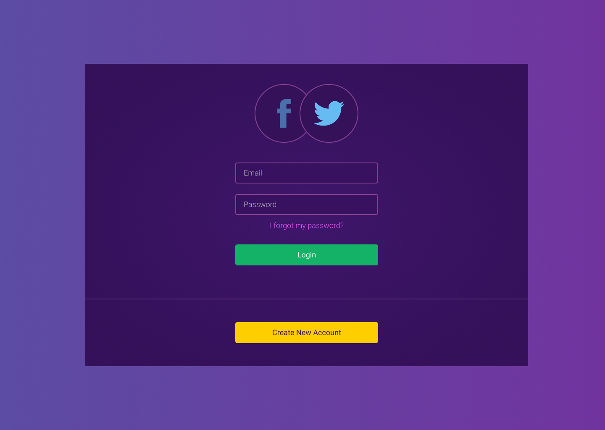

# FrontEnd Challenge Template

# Info

This project was made to practice my skills in SCSS.

### TODO

- [ ] fix <a> tag pseudo classes
- [ ] add media pseudo classes

 

- [ ] edit FETemplate files:
 - add scss page folder
 - add static folder
 - fix autoprefix 
